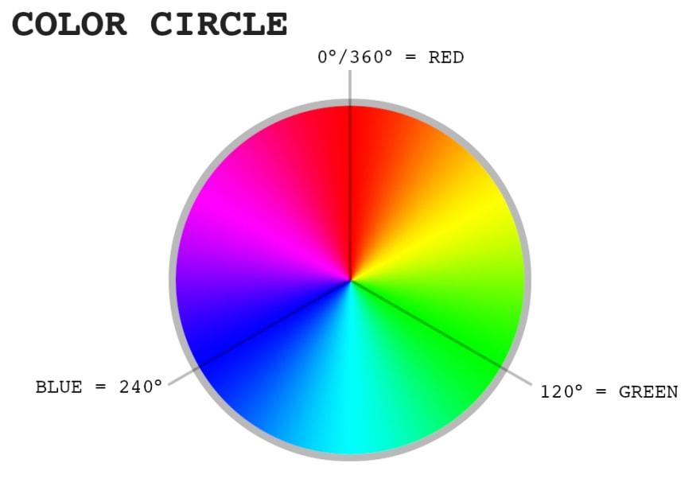

# Project 5
---

[Color wheel](https://github.com/beshad/yoobee/blob/master/webdevelopment/materials/color-wheel.jpg)

#### Example of a table in markdown language
| header 1 | header 2 | header 3 |
| ---:     | :---:    | ---      |
| item 1   | item 2   | item 11  |
| item 4   | item 10  | item xyz |

#### CSS color names
1  aliceblue   rgb(240, 248, 255)
 2  antiquewhite    rgb(250, 235, 215)
 3  aqua    rgb( 0, 255, 255)
 4  aquamarine  rgb(127, 255, 212)
 5  azure   rgb(240, 255, 255)
 6  beige   rgb(245, 245, 220)
 7  bisque  rgb(255, 228, 196)
 8  black   rgb( 0, 0, 0)
 9  blanchedalmond  rgb(255, 235, 205)
10  blue    rgb( 0, 0, 255)
11  blueviolet  rgb(138, 43, 226)
12  brown   rgb(165, 42, 42)
13  burlywood   rgb(222, 184, 135)
14  cadetblue   rgb( 95, 158, 160)
15  chartreuse  rgb(127, 255, 0)
16  chocolate   rgb(210, 105, 30)
17  coral   rgb(255, 127, 80)
18  cornflowerblue  rgb(100, 149, 237)
19  cornsilk    rgb(255, 248, 220)
20  crimson rgb(220, 20, 60)
21  cyan    rgb( 0, 255, 255)
22  darkblue    rgb( 0, 0, 139)
23  darkcyan    rgb( 0, 139, 139)
24  darkgoldenrod   rgb(184, 134, 11)
25  darkgray    rgb(169, 169, 169)
26  darkgreen   rgb( 0, 100, 0)
27  darkgrey    rgb(169, 169, 169)
28  darkkhaki   rgb(189, 183, 107)
29  darkmagenta rgb(139, 0, 139)
30  darkolivegreen  rgb( 85, 107, 47)
31  darkorange  rgb(255, 140, 0)
32  darkorchid  rgb(153, 50, 204)
33  darkred rgb(139, 0, 0)
34  darksalmon  rgb(233, 150, 122)
35  darkseagreen    rgb(143, 188, 143)
36  darkslateblue   rgb( 72, 61, 139)
37  darkslategray   rgb( 47, 79, 79)
38  darkslategrey   rgb( 47, 79, 79)
39  darkturquoise   rgb( 0, 206, 209)
40  darkviolet  rgb(148, 0, 211)
41  deeppink    rgb(255, 20, 147)
42  deepskyblue rgb( 0, 191, 255)
43  dimgray rgb(105, 105, 105)
44  dimgrey rgb(105, 105, 105)
45  dodgerblue  rgb( 30, 144, 255)
46  firebrick   rgb(178, 34, 34)
47  floralwhite rgb(255, 250, 240)
48  forestgreen rgb( 34, 139, 34)
49  fuchsia rgb(255, 0, 255)
50  gainsboro   rgb(220, 220, 220)
51  ghostwhite  rgb(248, 248, 255)
52  gold    rgb(255, 215, 0)
53  goldenrod   rgb(218, 165, 32)
54  gray    rgb(128, 128, 128)
55  grey    rgb(128, 128, 128)
56  green   rgb( 0, 128, 0)
57  greenyellow rgb(173, 255, 47)
58  honeydew    rgb(240, 255, 240)
59  hotpink rgb(255, 105, 180)
60  indianred   rgb(205, 92, 92)
61  indigo  rgb( 75, 0, 130)
62  ivory   rgb(255, 255, 240)
63  khaki   rgb(240, 230, 140)
64  lavender    rgb(230, 230, 250)
65  lavenderblush   rgb(255, 240, 245)
66  lawngreen   rgb(124, 252, 0)
67  lemonchiffon    rgb(255, 250, 205)
68  lightblue   rgb(173, 216, 230)
69  lightcoral  rgb(240, 128, 128)
70  lightcyan   rgb(224, 255, 255)
71  lightgoldenrodyellow    rgb(250, 250, 210)
72  lightgray   rgb(211, 211, 211)
73  lightgreen  rgb(144, 238, 144)
74  lightgrey   rgb(211, 211, 211)
75  lightpink   rgb(255, 182, 193)
76  lightsalmon rgb(255, 160, 122)
77  lightseagreen   rgb( 32, 178, 170)
78  lightskyblue    rgb(135, 206, 250)
79  lightslategray  rgb(119, 136, 153)
80  lightslategrey  rgb(119, 136, 153)
81  lightsteelblue  rgb(176, 196, 222)
82  lightyellow rgb(255, 255, 224)
83  lime    rgb( 0, 255, 0)
84  limegreen   rgb( 50, 205, 50)
85  linen   rgb(250, 240, 230)
86  magenta rgb(255, 0, 255)
87  maroon  rgb(128, 0, 0)
88  mediumaquamarine    rgb(102, 205, 170)
89  mediumblue  rgb( 0, 0, 205)
90  mediumorchid    rgb(186, 85, 211)
91  mediumpurple    rgb(147, 112, 219)
92  mediumseagreen  rgb( 60, 179, 113)
93  mediumslateblue rgb(123, 104, 238)
94  mediumspringgreen   rgb( 0, 250, 154)
95  mediumturquoise rgb( 72, 209, 204)
96  mediumvioletred rgb(199, 21, 133)
97  midnightblue    rgb( 25, 25, 112)
98  mintcream   rgb(245, 255, 250)
99  mistyrose   rgb(255, 228, 225)
100 moccasin    rgb(255, 228, 181)
101 navajowhite rgb(255, 222, 173)
102 navy    rgb( 0, 0, 128)
103 oldlace rgb(253, 245, 230)
104 olive   rgb(128, 128, 0)
105 olivedrab   rgb(107, 142, 35)
106 orange  rgb(255, 165, 0)
107 orangered   rgb(255, 69, 0)
108 orchid  rgb(218, 112, 214)
109 palegoldenrod   rgb(238, 232, 170)
110 palegreen   rgb(152, 251, 152)
111 paleturquoise   rgb(175, 238, 238)
112 palevioletred   rgb(219, 112, 147)
113 papayawhip  rgb(255, 239, 213)
114 peachpuff   rgb(255, 218, 185)
115 peru    rgb(205, 133, 63)
116 pink    rgb(255, 192, 203)
117 plum    rgb(221, 160, 221)
118 powderblue  rgb(176, 224, 230)
119 purple  rgb(128, 0, 128)
120 red rgb(255, 0, 0)1  aliceblue   rgb(240, 248, 255)
 2  antiquewhite    rgb(250, 235, 215)
 3  aqua    rgb( 0, 255, 255)
 4  aquamarine  rgb(127, 255, 212)
 5  azure   rgb(240, 255, 255)
 6  beige   rgb(245, 245, 220)
 7  bisque  rgb(255, 228, 196)
 8  black   rgb( 0, 0, 0)
 9  blanchedalmond  rgb(255, 235, 205)
10  blue    rgb( 0, 0, 255)
11  blueviolet  rgb(138, 43, 226)
12  brown   rgb(165, 42, 42)
13  burlywood   rgb(222, 184, 135)
14  cadetblue   rgb( 95, 158, 160)
15  chartreuse  rgb(127, 255, 0)
16  chocolate   rgb(210, 105, 30)
17  coral   rgb(255, 127, 80)
18  cornflowerblue  rgb(100, 149, 237)
19  cornsilk    rgb(255, 248, 220)
20  crimson rgb(220, 20, 60)
21  cyan    rgb( 0, 255, 255)
22  darkblue    rgb( 0, 0, 139)
23  darkcyan    rgb( 0, 139, 139)
24  darkgoldenrod   rgb(184, 134, 11)
25  darkgray    rgb(169, 169, 169)
26  darkgreen   rgb( 0, 100, 0)
27  darkgrey    rgb(169, 169, 169)
28  darkkhaki   rgb(189, 183, 107)
29  darkmagenta rgb(139, 0, 139)
30  darkolivegreen  rgb( 85, 107, 47)
31  darkorange  rgb(255, 140, 0)
32  darkorchid  rgb(153, 50, 204)
33  darkred rgb(139, 0, 0)
34  darksalmon  rgb(233, 150, 122)
35  darkseagreen    rgb(143, 188, 143)
36  darkslateblue   rgb( 72, 61, 139)
37  darkslategray   rgb( 47, 79, 79)
38  darkslategrey   rgb( 47, 79, 79)
39  darkturquoise   rgb( 0, 206, 209)
40  darkviolet  rgb(148, 0, 211)
41  deeppink    rgb(255, 20, 147)
42  deepskyblue rgb( 0, 191, 255)
43  dimgray rgb(105, 105, 105)
44  dimgrey rgb(105, 105, 105)
45  dodgerblue  rgb( 30, 144, 255)
46  firebrick   rgb(178, 34, 34)
47  floralwhite rgb(255, 250, 240)
48  forestgreen rgb( 34, 139, 34)
49  fuchsia rgb(255, 0, 255)
50  gainsboro   rgb(220, 220, 220)
51  ghostwhite  rgb(248, 248, 255)
52  gold    rgb(255, 215, 0)
53  goldenrod   rgb(218, 165, 32)
54  gray    rgb(128, 128, 128)
55  grey    rgb(128, 128, 128)
56  green   rgb( 0, 128, 0)
57  greenyellow rgb(173, 255, 47)
58  honeydew    rgb(240, 255, 240)
59  hotpink rgb(255, 105, 180)
60  indianred   rgb(205, 92, 92)
61  indigo  rgb( 75, 0, 130)
62  ivory   rgb(255, 255, 240)
63  khaki   rgb(240, 230, 140)
64  lavender    rgb(230, 230, 250)
65  lavenderblush   rgb(255, 240, 245)
66  lawngreen   rgb(124, 252, 0)
67  lemonchiffon    rgb(255, 250, 205)
68  lightblue   rgb(173, 216, 230)
69  lightcoral  rgb(240, 128, 128)
70  lightcyan   rgb(224, 255, 255)
71  lightgoldenrodyellow    rgb(250, 250, 210)
72  lightgray   rgb(211, 211, 211)
73  lightgreen  rgb(144, 238, 144)
74  lightgrey   rgb(211, 211, 211)
75  lightpink   rgb(255, 182, 193)
76  lightsalmon rgb(255, 160, 122)
77  lightseagreen   rgb( 32, 178, 170)
78  lightskyblue    rgb(135, 206, 250)
79  lightslategray  rgb(119, 136, 153)
80  lightslategrey  rgb(119, 136, 153)
81  lightsteelblue  rgb(176, 196, 222)
82  lightyellow rgb(255, 255, 224)
83  lime    rgb( 0, 255, 0)
84  limegreen   rgb( 50, 205, 50)
85  linen   rgb(250, 240, 230)
86  magenta rgb(255, 0, 255)
87  maroon  rgb(128, 0, 0)
88  mediumaquamarine    rgb(102, 205, 170)
89  mediumblue  rgb( 0, 0, 205)
90  mediumorchid    rgb(186, 85, 211)
91  mediumpurple    rgb(147, 112, 219)
92  mediumseagreen  rgb( 60, 179, 113)
93  mediumslateblue rgb(123, 104, 238)
94  mediumspringgreen   rgb( 0, 250, 154)
95  mediumturquoise rgb( 72, 209, 204)
96  mediumvioletred rgb(199, 21, 133)
97  midnightblue    rgb( 25, 25, 112)
98  mintcream   rgb(245, 255, 250)
99  mistyrose   rgb(255, 228, 225)
100 moccasin    rgb(255, 228, 181)
101 navajowhite rgb(255, 222, 173)
102 navy    rgb( 0, 0, 128)
103 oldlace rgb(253, 245, 230)
104 olive   rgb(128, 128, 0)
105 olivedrab   rgb(107, 142, 35)
106 orange  rgb(255, 165, 0)
107 orangered   rgb(255, 69, 0)
108 orchid  rgb(218, 112, 214)
109 palegoldenrod   rgb(238, 232, 170)
110 palegreen   rgb(152, 251, 152)
111 paleturquoise   rgb(175, 238, 238)
112 palevioletred   rgb(219, 112, 147)
113 papayawhip  rgb(255, 239, 213)
114 peachpuff   rgb(255, 218, 185)
115 peru    rgb(205, 133, 63)
116 pink    rgb(255, 192, 203)
117 plum    rgb(221, 160, 221)
118 powderblue  rgb(176, 224, 230)
119 purple  rgb(128, 0, 128)
120 red rgb(255, 0, 0)
121 rosybrown   rgb(188, 143, 143)
122 royalblue   rgb( 65, 105, 225)
123 saddlebrown rgb(139, 69, 19)
124 salmon  rgb(250, 128, 114)
125 sandybrown  rgb(244, 164, 96)
126 seagreen    rgb( 46, 139, 87)
127 seashell    rgb(255, 245, 238)
128 sienna  rgb(160, 82, 45)
129 silver  rgb(192, 192, 192)
130 skyblue rgb(135, 206, 235)1  aliceblue   rgb(240, 248, 255)
 2  antiquewhite    rgb(250, 235, 215)
 3  aqua    rgb( 0, 255, 255)
 4  aquamarine  rgb(127, 255, 212)
 5  azure   rgb(240, 255, 255)
 6  beige   rgb(245, 245, 220)
 7  bisque  rgb(255, 228, 196)
 8  black   rgb( 0, 0, 0)
 9  blanchedalmond  rgb(255, 235, 205)
10  blue    rgb( 0, 0, 255)
11  blueviolet  rgb(138, 43, 226)
12  brown   rgb(165, 42, 42)
13  burlywood   rgb(222, 184, 135)
14  cadetblue   rgb( 95, 158, 160)
15  chartreuse  rgb(127, 255, 0)
16  chocolate   rgb(210, 105, 30)
17  coral   rgb(255, 127, 80)
18  cornflowerblue  rgb(100, 149, 237)
19  cornsilk    rgb(255, 248, 220)
20  crimson rgb(220, 20, 60)
21  cyan    rgb( 0, 255, 255)
22  darkblue    rgb( 0, 0, 139)
23  darkcyan    rgb( 0, 139, 139)
24  darkgoldenrod   rgb(184, 134, 11)
25  darkgray    rgb(169, 169, 169)
26  darkgreen   rgb( 0, 100, 0)
27  darkgrey    rgb(169, 169, 169)
28  darkkhaki   rgb(189, 183, 107)
29  darkmagenta rgb(139, 0, 139)
30  darkolivegreen  rgb( 85, 107, 47)
31  darkorange  rgb(255, 140, 0)
32  darkorchid  rgb(153, 50, 204)
33  darkred rgb(139, 0, 0)
34  darksalmon  rgb(233, 150, 122)
35  darkseagreen    rgb(143, 188, 143)
36  darkslateblue   rgb( 72, 61, 139)
37  darkslategray   rgb( 47, 79, 79)
38  darkslategrey   rgb( 47, 79, 79)
39  darkturquoise   rgb( 0, 206, 209)
40  darkviolet  rgb(148, 0, 211)
41  deeppink    rgb(255, 20, 147)
42  deepskyblue rgb( 0, 191, 255)
43  dimgray rgb(105, 105, 105)
44  dimgrey rgb(105, 105, 105)
45  dodgerblue  rgb( 30, 144, 255)
46  firebrick   rgb(178, 34, 34)
47  floralwhite rgb(255, 250, 240)
48  forestgreen rgb( 34, 139, 34)
49  fuchsia rgb(255, 0, 255)
50  gainsboro   rgb(220, 220, 220)
51  ghostwhite  rgb(248, 248, 255)
52  gold    rgb(255, 215, 0)
53  goldenrod   rgb(218, 165, 32)
54  gray    rgb(128, 128, 128)
55  grey    rgb(128, 128, 128)
56  green   rgb( 0, 128, 0)
57  greenyellow rgb(173, 255, 47)
58  honeydew    rgb(240, 255, 240)
59  hotpink rgb(255, 105, 180)
60  indianred   rgb(205, 92, 92)
61  indigo  rgb( 75, 0, 130)
62  ivory   rgb(255, 255, 240)
63  khaki   rgb(240, 230, 140)
64  lavender    rgb(230, 230, 250)
65  lavenderblush   rgb(255, 240, 245)
66  lawngreen   rgb(124, 252, 0)
67  lemonchiffon    rgb(255, 250, 205)
68  lightblue   rgb(173, 216, 230)
69  lightcoral  rgb(240, 128, 128)
70  lightcyan   rgb(224, 255, 255)
71  lightgoldenrodyellow    rgb(250, 250, 210)
72  lightgray   rgb(211, 211, 211)
73  lightgreen  rgb(144, 238, 144)
74  lightgrey   rgb(211, 211, 211)
75  lightpink   rgb(255, 182, 193)
76  lightsalmon rgb(255, 160, 122)
77  lightseagreen   rgb( 32, 178, 170)
78  lightskyblue    rgb(135, 206, 250)
79  lightslategray  rgb(119, 136, 153)
80  lightslategrey  rgb(119, 136, 153)
81  lightsteelblue  rgb(176, 196, 222)
82  lightyellow rgb(255, 255, 224)
83  lime    rgb( 0, 255, 0)
84  limegreen   rgb( 50, 205, 50)
85  linen   rgb(250, 240, 230)
86  magenta rgb(255, 0, 255)
87  maroon  rgb(128, 0, 0)
88  mediumaquamarine    rgb(102, 205, 170)
89  mediumblue  rgb( 0, 0, 205)
90  mediumorchid    rgb(186, 85, 211)
91  mediumpurple    rgb(147, 112, 219)
92  mediumseagreen  rgb( 60, 179, 113)
93  mediumslateblue rgb(123, 104, 238)
94  mediumspringgreen   rgb( 0, 250, 154)
95  mediumturquoise rgb( 72, 209, 204)
96  mediumvioletred rgb(199, 21, 133)
97  midnightblue    rgb( 25, 25, 112)
98  mintcream   rgb(245, 255, 250)
99  mistyrose   rgb(255, 228, 225)
100 moccasin    rgb(255, 228, 181)
101 navajowhite rgb(255, 222, 173)
102 navy    rgb( 0, 0, 128)
103 oldlace rgb(253, 245, 230)
104 olive   rgb(128, 128, 0)
105 olivedrab   rgb(107, 142, 35)
106 orange  rgb(255, 165, 0)
107 orangered   rgb(255, 69, 0)
108 orchid  rgb(218, 112, 214)
109 palegoldenrod   rgb(238, 232, 170)
110 palegreen   rgb(152, 251, 152)
111 paleturquoise   rgb(175, 238, 238)
112 palevioletred   rgb(219, 112, 147)
113 papayawhip  rgb(255, 239, 213)
114 peachpuff   rgb(255, 218, 185)
115 peru    rgb(205, 133, 63)
116 pink    rgb(255, 192, 203)
117 plum    rgb(221, 160, 221)
118 powderblue  rgb(176, 224, 230)
119 purple  rgb(128, 0, 128)
120 red rgb(255, 0, 0)
121 rosybrown   rgb(188, 143, 143)
122 royalblue   rgb( 65, 105, 225)
123 saddlebrown rgb(139, 69, 19)
124 salmon  rgb(250, 128, 114)
125 sandybrown  rgb(244, 164, 96)
126 seagreen    rgb( 46, 139, 87)
127 seashell    rgb(255, 245, 238)
128 sienna  rgb(160, 82, 45)
129 silver  rgb(192, 192, 192)
130 skyblue rgb(135, 206, 235)
131 slateblue   rgb(106, 90, 205)
132 slategray   rgb(112, 128, 144)
133 slategrey   rgb(112, 128, 144)
134 snow    rgb(255, 250, 250)
135 springgreen rgb( 0, 255, 127)
136 steelblue   rgb( 70, 130, 180)
137 tan rgb(210, 180, 140)
138 teal    rgb( 0, 128, 128)
139 thistle rgb(216, 191, 216)
140 tomato  rgb(255, 99, 71)
141 turquoise   rgb( 64, 224, 208)
142 violet  rgb(238, 130, 238)
143 wheat   rgb(245, 222, 179)
144 white   rgb(255, 255, 255)
145 whitesmoke  rgb(245, 245, 245)
146 yellow  rgb(255, 255, 0)
147 yellowgreen rgb(154, 205, 50) 
131 slateblue   rgb(106, 90, 205)
132 slategray   rgb(112, 128, 144)
133 slategrey   rgb(112, 128, 144)
134 snow    rgb(255, 250, 250)
135 springgreen rgb( 0, 255, 127)
136 steelblue   rgb( 70, 130, 180)
137 tan rgb(210, 180, 140)
138 teal    rgb( 0, 128, 128)
139 thistle rgb(216, 191, 216)
140 tomato  rgb(255, 99, 71)
141 turquoise   rgb( 64, 224, 208)
142 violet  rgb(238, 130, 238)
143 wheat   rgb(245, 222, 179)
144 white   rgb(255, 255, 255)
145 whitesmoke  rgb(245, 245, 245)
146 yellow  rgb(255, 255, 0)
147 yellowgreen rgb(154, 205, 50) 
121 rosybrown   rgb(188, 143, 143)
122 royalblue   rgb( 65, 105, 225)
123 saddlebrown rgb(139, 69, 19)
124 salmon  rgb(250, 128, 114)
125 sandybrown  rgb(244, 164, 96)
126 seagreen    rgb( 46, 139, 87)
127 seashell    rgb(255, 245, 238)
128 sienna  rgb(160, 82, 45)
129 silver  rgb(192, 192, 192)
130 skyblue rgb(135, 206, 235)
131 slateblue   rgb(106, 90, 205)
132 slategray   rgb(112, 128, 144)
133 slategrey   rgb(112, 128, 144)
134 snow    rgb(255, 250, 250)
135 springgreen rgb( 0, 255, 127)
136 steelblue   rgb( 70, 130, 180)
137 tan rgb(210, 180, 140)
138 teal    rgb( 0, 128, 128)
139 thistle rgb(216, 191, 216)
140 tomato  rgb(255, 99, 71)
141 turquoise   rgb( 64, 224, 208)
142 violet  rgb(238, 130, 238)
143 wheat   rgb(245, 222, 179)
144 white   rgb(255, 255, 255)
145 whitesmoke  rgb(245, 245, 245)
146 yellow  rgb(255, 255, 0)
147 yellowgreen rgb(154, 205, 50) 